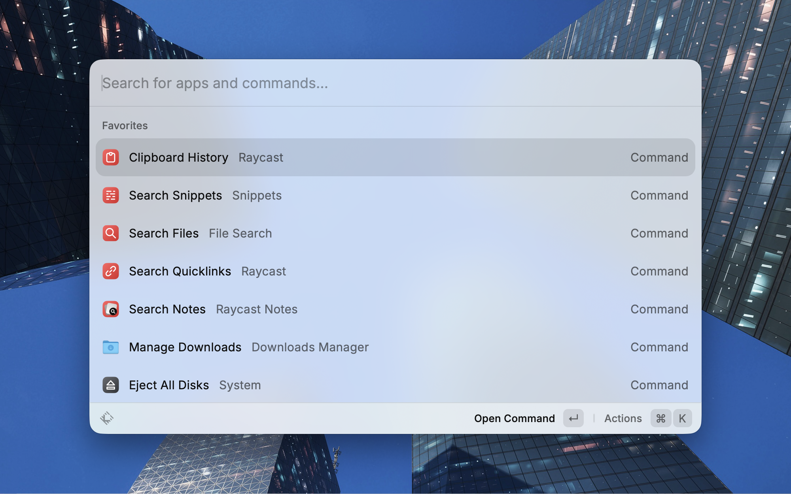
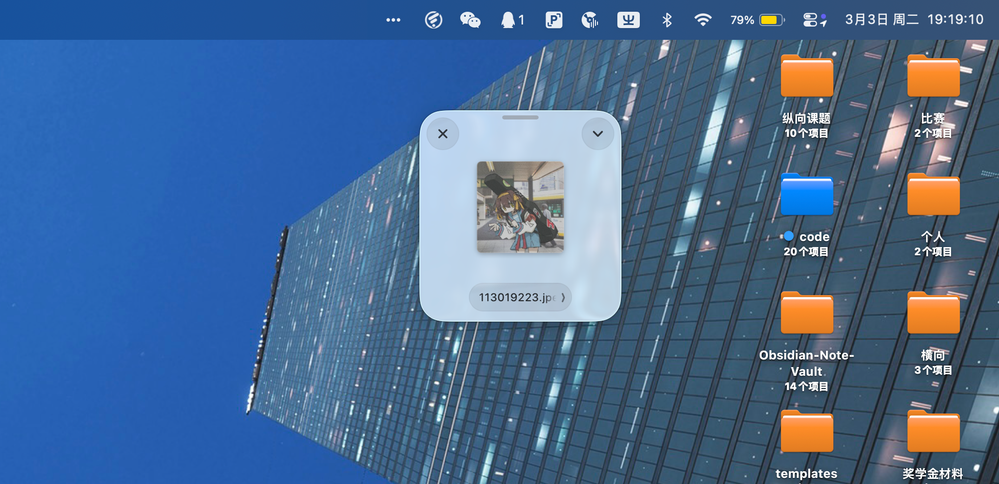
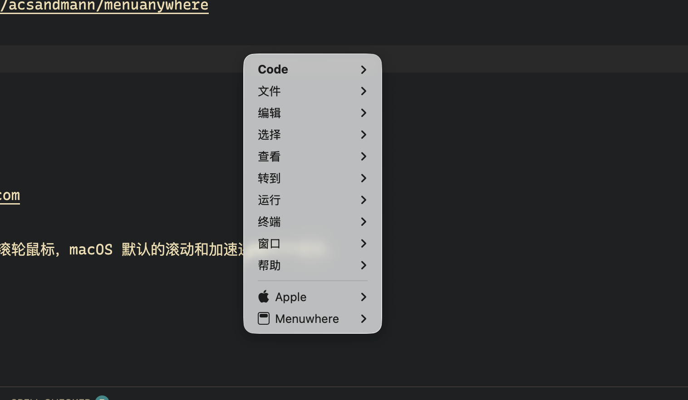
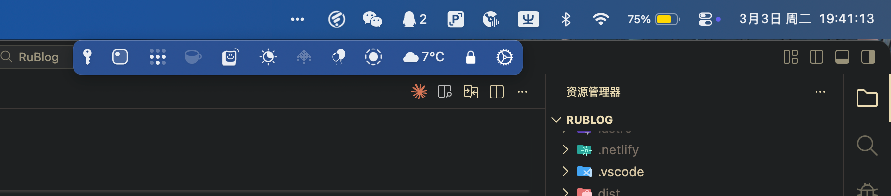
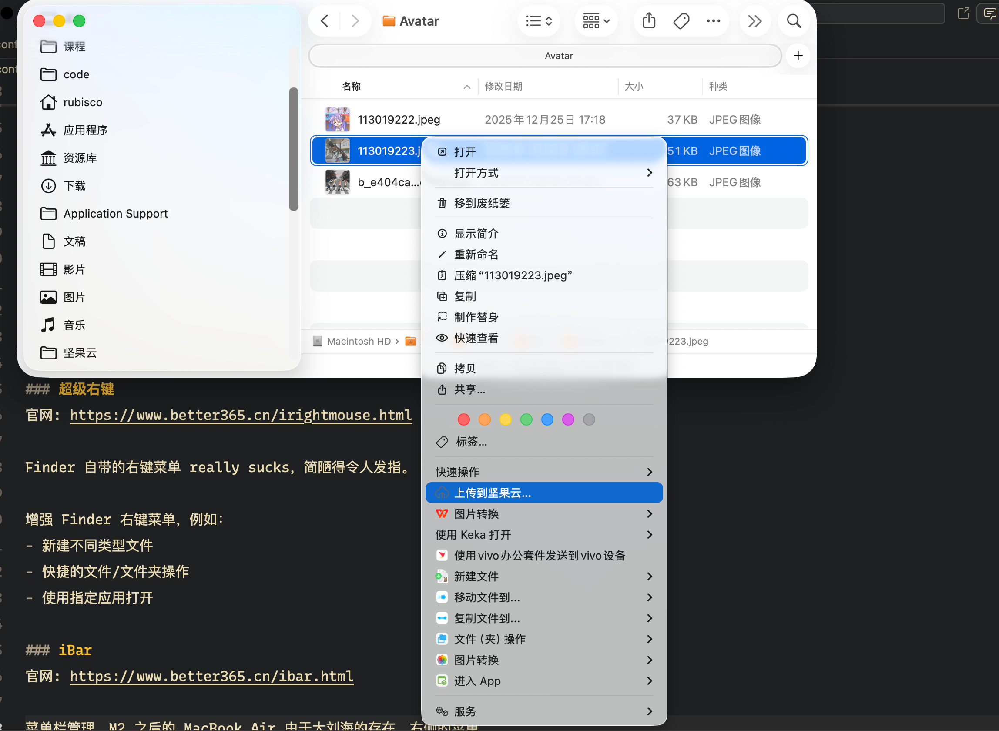
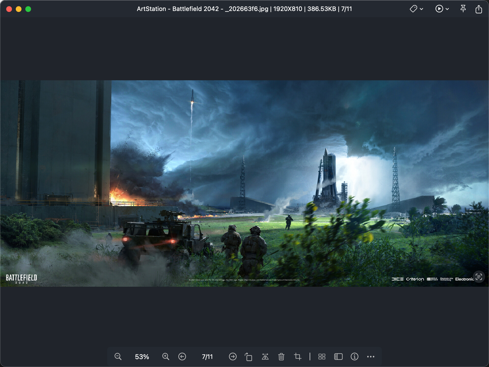
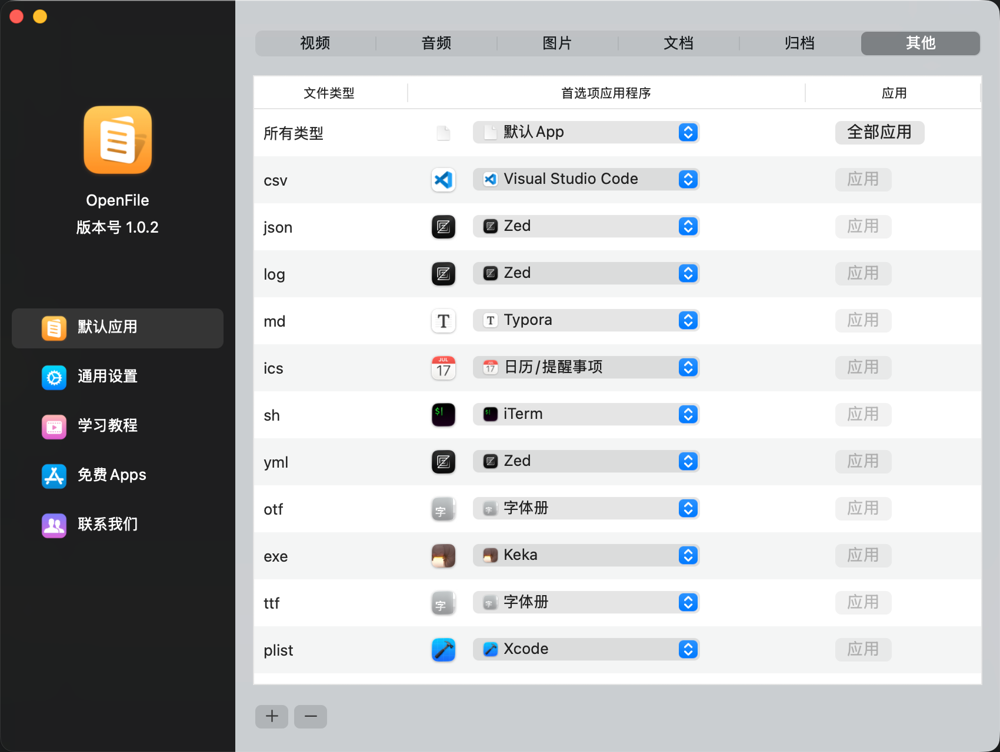
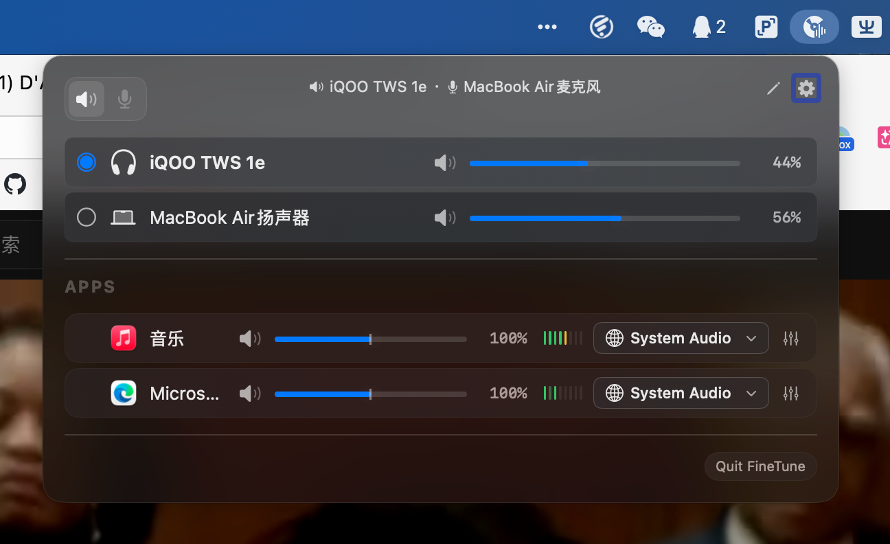

## 窗口切换管理与操作体验增强

### AltTab：和Windows完全一致的窗口切换体验
GitHub: https://github.com/lwouis/alt-tab-macos  

在窗口切换上，MacOS 自带的解决方案有两种：
- 原生的`cmd+tab`应用切换，只能切换应用，且无法预览窗口内容，被win的方案吊起来打
- 快捷键 + **调度中心**，难受的点在于鼠标放到窗口上之后还需要单击才能切换，还是不够块 

AltTab 提供接近 Windows 的窗口级切换体验，支持：
- 支持最小化窗口
- 可自定义快捷键
- 支持对特定应用进行单独配置显示方案
- 通过窗口名称过滤器对部分窗口进行隐藏

### Raycast：键盘友好的全能启动器
官网: https://www.raycast.com  

Raycast 是 macOS 上的启动器与自动化工具，类似于：
- Windows 的 PowerToys Run
- MacOS 上的 Alfred

功能包括：
- 应用启动
- 文件搜索
- 剪贴板历史
- 脚本执行
- Snippet 管理
- 丰富插件生态系统，Everything you need

插件使用 React + Raycast 工具库开发，应该是 React Native 方案。

### Dropover：简单的文件中转站
官网: https://dropoverapp.com  

拖拽多个文件时不方便暂存，Dropover 可以在屏幕边缘生成一个中转站来临时存放。
最好用的唤起方式是：选择多个文件文件后拖动并晃动鼠标，非常有意思的交互。

### MenuWhere：随处打开应用菜单
官网: https://manytricks.com/menuwhere/ 

使用 `cmd+rightclick` 在屏幕的任意位置打开当前应用的顶部应用菜单。

### MenuAnyWhere
GitHub: https://github.com/acsandmann/menuanywhere

MenuWhere 的开源解决方案。

### AutoRaise：鼠标悬停时自动聚焦
GitHub: https://github.com/sbmpost/AutoRaise  

实现：
- 鼠标悬停自动激活窗口
- 自动前置（自选）

### iBar：状态栏图标管理
官网: https://www.better365.cn/ibar.html  

M2 之后的 MacBook Air 由于大刘海的存在，状态栏右侧的图标非常拥挤。

iBar 可以显示一个副菜单栏来存放不太常用，但又需要在菜单栏常驻的应用图标。

## 输入与鼠标增强

### Mac Mouse Fix：用第三方鼠标不装这个就受着 
GitHub: https://github.com/noah-nuebling/mac-mouse-fix 

MacOS 典中典鼠标默认滚轮方向是反着来的，且第三方普通鼠标体验极差。

Mac Mouse Fix 可以：
- 自定义侧键
- 调整滚动方向
- 平滑滚动

## 文件管理与预览

### 超级右键：Finder 右键菜单增强
官网: https://www.better365.cn/irightmouse.html  

Finder 自带的右键菜单 really sucks，简陋得令人发指。

增强 Finder 右键菜单，例如：
- 新建不同类型文件
- 快捷的文件/文件夹操作
- 使用指定应用打开

### PicView：图片查看器
官网: https://picview.chitaner.com  

自带的**预览**过于简陋，必须要一个图片查看器。

- 支持多种格式
- 左右切换查看同目录下其他图片
- 支持窗口置顶与贴图

### OpenFile：配置文件的默认打开应用

MacOS 自带的设置文件默认打开应用的方式非常分散，不便集中管理。

开源解决方案有非常古早的，只有 CLI 方式的 [duti](https://github.com/moretension/duti) ，以及基于此开发，有交互式 CLI 的 [dutis](https://github.com/tsonglew/dutis)（依旧 CLI ）

OpenFile 提供了一个 GUI 界面，且功能比上述二者更丰富。

- 集中设置文件格式的默认打开程序
- 支持批量设置

## 系统优化与自动化

### Amphetamine：现在不允许睡觉
App Store: https://apps.apple.com/us/app/amphetamine/id937984704?mt=12  

防止系统休眠：
- 插电常亮（可自定义配置）
- 触发器：特定情况下保持唤醒（如某些应用运行时）
- 关屏/合盖不休眠

### Caffeinated  

官网: https://caffeinated.app/

功能简化版的 Amphetamine，更方便。

### Shifty：夜间模式增强
GitHub: https://github.com/thompsonate/Shifty  

更精细地控制夜览模式或黑暗模式：
- 自定义夜览或黑暗模式启动的时间段

### XApp：应用卸载与清理

官网: https://www.better365.cn/xapp.html

依旧 Better365 出品，这公司是 MacOS 时尚小垃圾专业户。

用于卸载应用，同时清理应用残留的各种文件

## 音频与录制工具

### FineTune：应用音量单独调节

MacOS 自带的音量管理基本没有。这是一个音频管理增强工具：
- 支持切换音频输入输出设备
- 对不同应用的音量单独进行调节
- 均衡器

## 设备互联

### Soduto：KDE Connect for Mac
GitHub: https://github.com/sannidhyaroy/Soduto  

用这个 fork 的版本，原 Soduto 仓库很久不维护了。

KDE Connect 的 MacOS 客户端，实现 MacOS 与 Android 设备互联：
- 通知同步
- 文件传输
- 剪贴板共享（最好用的功能）

## 密码管理

### Keyden：菜单栏里的 2FA 客户端
GitHub: https://github.com/tasselx/Keyden

不需要离开电脑就能快速获取 2FA TOTP。

- 密钥安全存储于 MacOS 钥匙串
- 支持扫码添加账号
- 使用 GitHub Gist 同步
